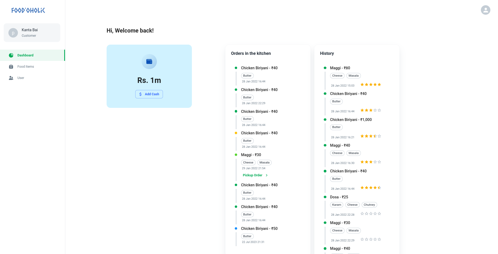
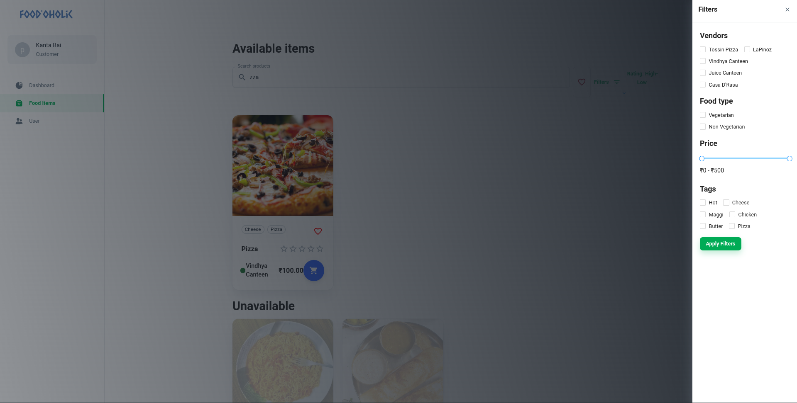
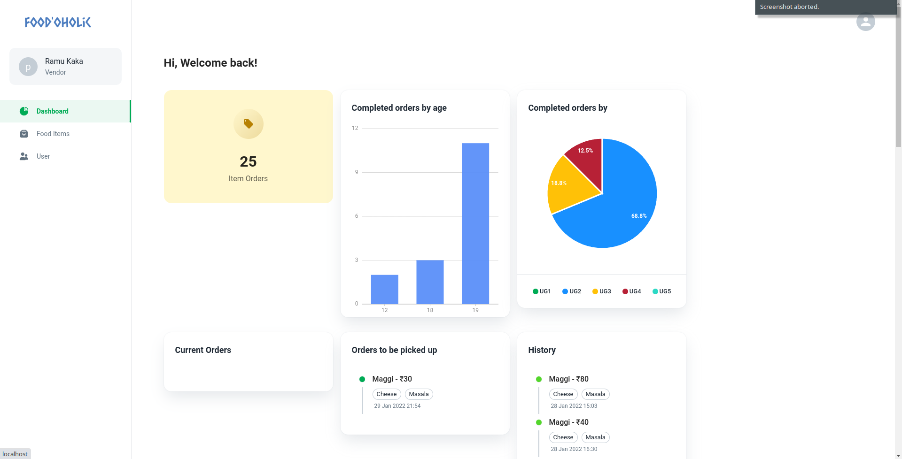
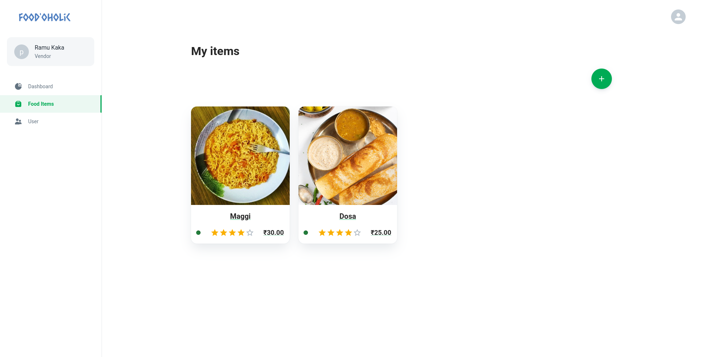
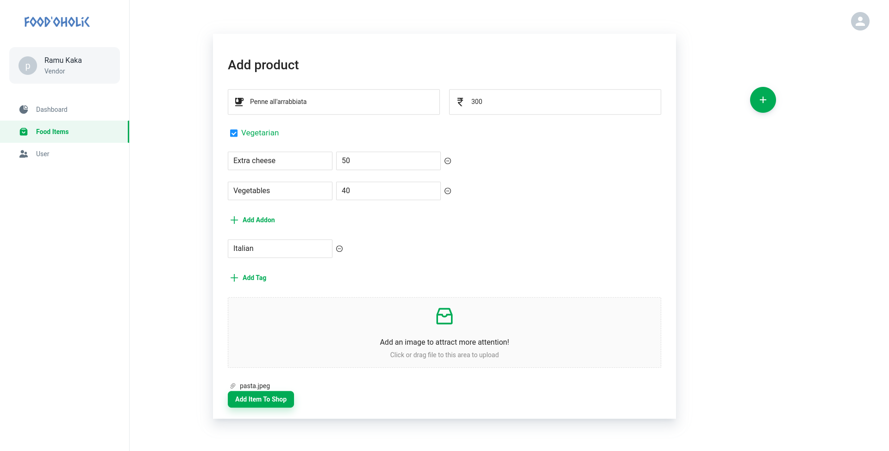

# Food'oholic

Food'oholic is a CRUD App built using the MERN Stack, utilizing Atlas as the cloud MongoDB option for database storage, Express for backend routing, and React for the frontend.

## Installation

### Atlas MongoDB

The entire project is hosted in a dockerized environment, requiring setup with [Atlas Cloud MongoDB](https://www.mongodb.com/). Follow these steps to create a new project and cluster:

1. **Getting Started with Atlas:** Review the [Atlas documentation](https://www.mongodb.com/docs/atlas/getting-started/) for an introduction to MongoDB Atlas.
2. **Create a Cluster:** Follow the steps outlined in the [Create a New Cluster tutorial](https://www.mongodb.com/docs/atlas/tutorial/create-new-cluster/) to create your cluster.

Once you've completed the above steps, click on the `Connect` button for your cluster to obtain the MongoDB URI necessary for connecting to your cluster. This information will be required in the subsequent steps.

### Google OAuth Credentials

To enable Google OAuth functionality, you need to obtain the necessary credentials from the Google Developers Console. Follow these instructions:

1. **Create a Project:** If you haven't done so already, create a project on the [Google Developers Console](https://console.developers.google.com/).
2. **Set Up OAuth Consent Screen:** Configure the OAuth consent screen with the required information for your application.
3. **Create OAuth Client ID:** Generate an OAuth Client ID for your project, specifying the necessary redirect URIs and scopes.
4. **Obtain Client ID:** After creating the OAuth Client ID, you will receive a `GOOGLE_OAUTH_CLIENT_ID`. Keep this ID handy as you'll need it in the next steps.

### Docker

The entire project is set up in a dockerized environment. To get started, ensure you have filled in the relevant information in the [docker-compose](docker-compose.yml) file:

```yaml
environment:
    - PORT=27017
    - FOODOHOLIC_DB_URI=<uri-you-got-from-the-above-steps>
    - DENV=development
    - SECRET=<your-secret>
    - SERVER_EMAIL=<send-alerts-to-this-email>
    - SERVER_PASS=<the-email-password>
    - GOOGLE_OAUTH_CLIENT_ID=<google-oauth-obtained-above>
```

Replace the placeholders (`<...>`) with the respective values:

- `<uri-you-got-from-the-above-steps>`: The MongoDB URI you obtained from the Atlas MongoDB setup.
- `<your-secret>`: Your chosen secret for securing your application.
- `<send-alerts-to-this-email>`: An email address to receive alerts from the server.
- `<the-email-password>`: The password for the email address to send alerts.
- `<google-oauth-obtained-above>`: The Google OAuth Client ID you obtained in the previous section.

## Docker Installation and Setup

To run Food'oholic in a dockerized environment, you'll need to have Docker installed on your system. Follow the instructions below to install Docker and start the application.

### Installing Docker

#### For Windows and macOS Users:

1. Visit the Docker website: [https://www.docker.com/products/docker-desktop](https://www.docker.com/products/docker-desktop)
2. Download and install Docker Desktop for your operating system.
3. Once installed, launch Docker from your applications.

#### For Linux Users:

1. Follow the official Docker documentation for Linux installation: [https://docs.docker.com/engine/install/](https://docs.docker.com/engine/install/)

### Starting the Application

After installing Docker, you can use the following commands to start the Food'oholic application:

1. Open your terminal or command prompt.
2. Navigate to the root directory of the Food'oholic project.
3. Use the following commands:

```bash
# Start Docker services (required before running the application)
sudo systemctl start docker  # For Linux users (optional, if not already started)

# Start the Food'oholic application using Docker Compose
docker-compose up
```

The application will now start running in the dockerized environment, and you can access it via your web browser on the localhost port.

Please note that the above commands assume that you have already replaced the placeholders in the `docker-compose.yml` file with the actual values obtained from the MongoDB setup and Google OAuth credentials sections.

## Gallery

Here are some screenshots of the Food'oholic site:

### Buyer Home Page

*Your one-look dashboard to know the current status of all your orders and manage your wallet efficiently!*

### Buyer Items Page

*Welcome to Food'oholic! Explore our vast selection of delicious dishes, complete with fuzzy search, filtering, and sort operations.*

### Vendor Home Page

*One-stop dashboard to manage all your current, pending, and past orders, along with a statistical summary of your entire order history!*

### Vendor Items Page

*Get ready to tantalize your taste buds with mouthwatering dishes, including a plate of pasta or a mouthwatering dosa - just a glimpse of the many delicacies available from our vendors.*

### Vendor Add Item Page

*Vendors can easily manage their culinary masterpieces on Food'oholic, adding new items to their menus effortlessly.*

